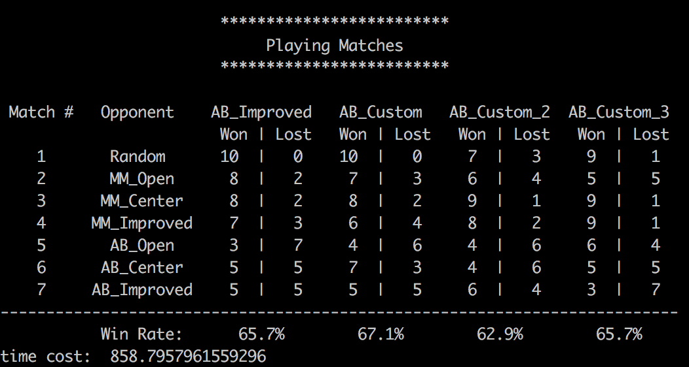

My code:

```python
def custom_score(game, player):
    if game.is_loser(player): return float("-inf")
    if game.is_winner(player): return float("inf")
    own_moves = len(game.get_legal_moves(player))
    opp_moves = len(game.get_legal_moves(game.get_opponent(player)))
    return float(-opp_moves) float(len(game.get_legal_moves(player)))
def custom_score_2(game, player):
    if game.is_loser(player): return float("-inf")
    if game.is_winner(player): return float("inf")
    own_moves = len(game.get_legal_moves(player))
    opp_moves = len(game.get_legal_moves(game.get_opponent(player)))
    return float(2*own_moves - opp_moves)
def custom_score_3(game, player):
    if game.is_loser(player): return float("-inf")
    if game.is_winner(player): return float("inf")
    own_moves = len(game.get_legal_moves(player))
    opp_moves = len(game.get_legal_moves(game.get_opponent(player)))
    return float(own_moves - 2*opp_moves)
```

`custom_score` is only focus on reducing opponent's move, which is inverse to  `open_move_score`;

`custom_score2` and `custom_score3` are variants of  `improved_score`. custom_score2 is more favored to increase own_moves, while custom_score3 is more favored to decrease opp_moves.

A full run costs 15 minutes. My result is:



How to read table? e.g. the first slot: AB_Improve wins 10 and lost 0 over Random

Because the first 2 move is random, the result may have some fluctuation. 

For player type,  AlphaBetaPlayer > MinimaxPlayer > RandomPlayer. This is expected, because RandomPlayer has no optimization, and AlphaBetaPlayer has iterative deepening that can think "deeper" than depth-limited MinimaxPlayer.

For evaluation functions, the tested 4 functions are quite similar, considering that the first 2 move is random and may cause fluctuation. 

I would recommend `custom_score` because the following 3 reasons:

1. rate: it has the **best overall winning rate** 
2. complexity: this is actually very straightforward. Because the winning criterior of the eliminate game is no legal move of opponent, it doesn't matter how many moves I have. 
3. depth:  because opp_moves is  considered, its actual depth is **one layer deeper** than `open_score` if given the same depth limitation.