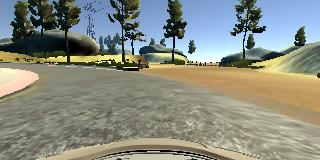

# Behavioral Cloning

The goals / steps of this project are the following:

- Use the simulator to collect data of good driving behavior
- Build, a convolution neural network in Keras that predicts steering angles from images
- Train and validate the model with a training and validation set
- Test that the model successfully drives around track one without leaving the road
- Summarize the results with a written report

My project includes the following files:

* model.py containing the script to create and train the model
* drive.py for driving the car in autonomous mode
* model.h5 containing a trained convolution neural network 
* writeup_report.md or writeup_report.pdf summarizing the results

I didn't use the writeup template. Because it limits my thinking. It is more for the grader rather than the learner. 

So, I would like to highlight 2 aspects of my project. 

#### 1. Model Architecture and Training Strategy

My model is mostly based on **NVIDIA architecture**, which consists of 5 CNN layers, dropout and 4 dense layer. Among the 5 CNN layers, 3 have 5x5 filter sizes and 2 have 3x3 filter size (model.py lines 49-53). These layers includes RELU layers to introduce nonlinearity. Then a **dropout** layer is subsequent to reduce overfitting (model.py lines 54). 

At the beginning of  the model,  data is **normalized** in the model using a Keras lambda layer and **cropped** by removing top 50 lines and bottom 20 lines of image data.

The model used an **adam optimizer**, so the learning rate was not tuned manually (model.py line 60).

The model was trained and validated on different data sets to ensure that the model was not overfitting (code 61). 

#### 2. source data, format and tricks

My final model only needs the official data provided by Udacity (data.zip, which includes 8036 images). 

I have tried these things:

- generate my own dataset by playing the game more than 10 laps
- augment data by flipping or multiple cameras
- save model trained on the whole laps and continue training on the sharp turns.

Because my car fails to steer enough in the sharp turns, I intentionally add training data in these areas:

However, I came to realize that as [Carlos Galvez](https://carnd-forums.udacity.com/questions/users?username=carlosgalvezp) pointed out in [a discussion kicked off by Paul Heraty](https://carnd-forums.udacity.com/questions/26214464/behavioral-cloning-cheatsheet#), **the No. 0 issue is drive.py sends RGB images to the model**; cv2.imread() reads images in BGR format. This teaches me a hard lesson: **never use cv2 to read image**. Intead, use `matplotlib.image.imread()` , which is the most-common practise accross different packages. 

So, in the end, I only use the offical data and the car was able to run through the simulator and stay on the track.
