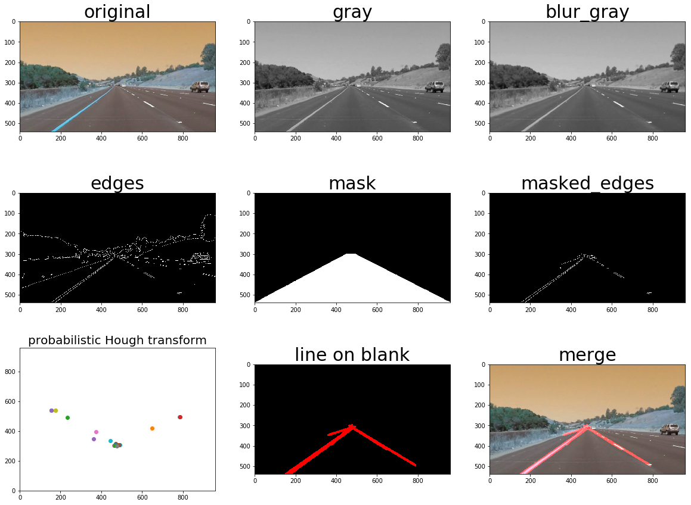

#**Finding Lane Lines on the Road** 
The goals / steps of this project are the following:
* Make a pipeline that finds lane lines on the road
* Reflect on your work in a written report
---
### Reflection

###1. Describe your pipeline. As part of the description, explain how you modified the draw_lines() function.

My pipeline consisted of following steps:

| step | Action                                   | code functions   |
| ---- | ---------------------------------------- | ---------------- |
| 1    | convert image file to 3D np array        | cv2.imread       |
| 2    | convert image to grayscale               | cv2.cvtColor     |
| 3    | smooth image to suppress noise           | cv2.GaussianBlur |
| 4    | **get edges by canny's gradient method** | cv2.Canny        |
| 5    | propose a mask region                    | cv2.fillPoly     |
| 6    | retain masked edges                      | cv2.bitwise_and  |
| 7    | **extract points that form lines**       | cv2.HoughLinesP  |
| 8    | draw lines on a  blank image             | cv2.line         |
| 9    | merge original image with lines          | cv2.addWeighted  |

The corresponding result for each state is:

I didn't modified the draw_lines() function. Although the lines seem odd with discontinuity, I keep as much original information as possible. Because it doens't matter so much to human eyes. What it really matters is how computer perceives the situation and makes rational decision.  

###2. Identify potential shortcomings with your current pipeline

1. Before going to technical details, it's better to be awared of the big picture. This is a quite ideal scenario: clear visibility, light traffic, straight road, clear lane lines, no road signs, no traffic lights, no blockage, etc.
2. For my current pipeline, the biggest problem is it heavily relies on manual tuning for the mask region. Distractive edges are simply filtered out by manual tweak. This is not an intelligent way and will not respond correctly to different road condition or even camera position. 
3. The final lines have discontinued area, which should be improved.

###3. Suggest possible improvements to your pipeline

1. use a more intelligent way to propose mask region
2. better line drawing function to form a closed area.
3. in the optional challenge, computer is confused by the curved lines and the separation wall which has simiar line shape. A possible improvement is to detect lines from image center to outer and set minimum lane gap. 