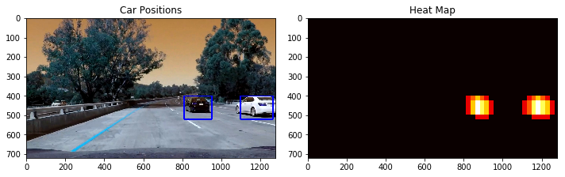

# Vehicle Detection Project

[Rubric](https://review.udacity.com/#!/rubrics/513/view) 

I don't use the writeup temple because I think it probably restricts learner's thinking. 

The main goals of this project is to use HOG as input feature and train a svm classifier, implement slidding windows and identify vehicles.

My basic workflow for this project is 3 steps:

1. train a classifier to recognize whether an image is car or not
2. define sliding windows, search and classify a single image
3. build pipeline to produce output video 

I will implement each step with further details. The codes are in the corresponding title order in the jupyter notebook.

# 1 compare different classifiers

1. data exploration
2. use raw image pixels(gray) + svc
3. use raw image pixels(3D) + neural nets
4. use histogram of raw image(3D) + svc
5. use histogram of gradient (3D) + svc
6. use histogram of gradient (gray) + svc

## data exploreation

- The number of car and non-car pictures are 8792 and 8968, which is a good balance. 
- Each png object has a shape of (64, 64, 3).
- I use `cv2.imread()`, so the color order is bgr. 
- by `raw_image/255.0 -0.5`, the values are processed to have 0 mean.
- data and labels are dumped for later use.  

## Compare different classifiers with different inpout features

How we tune the HOG parameters really depends on how the final classifier performs. 

Here is the comparison table. The hog parameters are the same with tutorial:

`hog(gray, orientations=9, pixels_per_cell=(8, 8), cells_per_block=(2, 2), feature_vector=False)`

| input         | length | classifier | time | accuray | Note     |
| ------------- | :----- | ---------- | ---- | ------- | -------- |
| gray          | 4096   | svc        | 420s | 0.89    |          |
| bgr           | 4096x3 | lenet      | 120s | 0.99    | 10 epoch |
| bgr histogram | 96     | svc        |      | 0.5     | useless  |
| bgr hog       | 5292   | svc        | 236s | 0.988   |          |
| gray hog      | 1764   | svc        | 78s  | 0.988   |          |

It seems that **bgr lenet** and **gray hog** are the best.

Note that each set of training data, scaler and  trained model are properly saved for later use. 

# 2 Define sliding windows, search and classify a single image

This step is divided into the following:

1. explore data to decide target area and window sizes for different area
2. create a list of sliding window
3. test gray hog svc 
4. test 3 color hog svc
5. test 3 color raw lenet
6. hotmap

## define sliding windows

By `cv2.VideoCapture` and `cv2.imwrite`, project_video.mp4 is decomposed into 1260 jpg images with shape (720,1280,3). 

By some data exploration and observation, I get:

1. useful portion of an image: y= (400,680), x=(400,1280)
2. the car appearing near has a size of (160,300) to (110,200)
3. the car in the faraway has a size of (20,20), may be ignore?

A function `slide_window(img, x_start,x_stop, y_start,y_stop,  xy_window, xy_overlap)` is revised based the one in the tutorial. I make some changes to simplfy the code.

An example for `slide_window(image, 400,1280, 400, 680,  xy_window=(64, 64), xy_overlap=(0.5, 0.5))` is:

## Apply the top 3 classifiers to the unseen data

For the above image, bgr/gray HOG features based svc fail to recognize the vehicle, but **bgr raw based lenet** can sucessfully detect the vehicle. I haven't tried YCrCb 3-channel HOG features due to time constraint. 

For lenet, the small window like 64x64 will cause a few false positive. Even with threshold = 2 can't filter out these false positive. Alternatively, I get better results with larger window and larger overloap. 

The image with detected window and hotmap is

### Video Implementation

####1. Provide a link to your final video output.  Your pipeline should perform reasonably well on the entire project video (somewhat wobbly or unstable bounding boxes are ok as long as you are identifying the vehicles most of the time with minimal false positives.)
Here's a [link to my video result](./project_output4.mp4)

####2. Describe how (and identify where in your code) you implemented some kind of filter for false positives and some method for combining overlapping bounding boxes.

My final pipeline use **bgr raw based lenet**, which seems to be more powerful than  bgr hog based svc. There are several details that worths to be mentioned:

1. the image is read by `cv2.imread` and processed exactly as what the data feed into the training model: 0 mean. 
2. resize to (64,64) and then reshape to (-1,64,64,3) for lenet. 
3. build a heatmap and use threshold to filter out noise. However, when the car is far away which only has only one window at hand, it will be filter out as noise. So finally I use threshold = 0.
4. use `scipy.ndimage.measurements.label()` to identify individual blobs in the heatmap.  Then I constructed bounding boxes to cover the area of each blob detected.
5. use `cv2.imwrote` to output image. Note that for the convenience of later conversion to video,   it is better to name the image file with leading zeros, `str(ind).zfill(4)`
6. use `glob.glob` to read these image files into a list and feed them into `ImageSequenceClip(imageList, fps=25)`, and fianlly `clip.write_videofile`

---

###Discussion

####1. Briefly discuss any problems / issues you faced in your implementation of this project.  Where will your pipeline likely fail?  What could you do to make it more robust?

There are some false positives where the lane lines are recognized as cars. However, set a higher threshold will filter out the car that is far away. 

So it is bette to fine tune the classifier by more training epoches or more complex neural network structure such as vgg or inception. These will very time consuming. Alternatively, fine tune the hog svm classifier by using different color space and diffeent hyper parameters. 